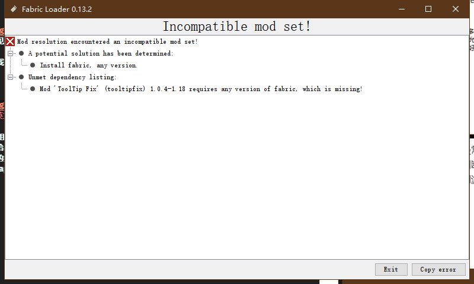
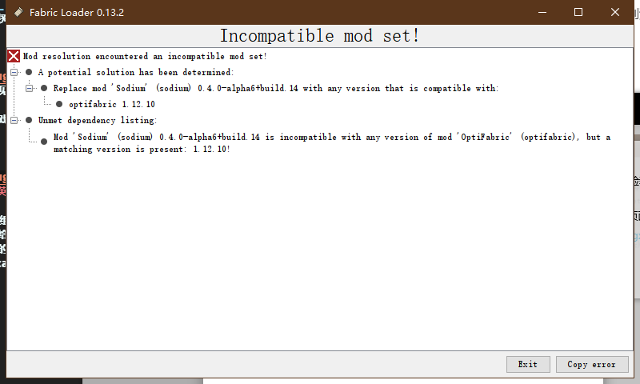

__仅列出部分容易出现的报错，如有其他典型日志可以提交至 LIPiston@outlook.com__

# 排错指南
首先你需要具备一定的判断能力  
其次你需要 __调 整 好 心 态__  
~~说不定待会解决完这个还会崩呢对吧~~

这个时候就有一个小难题 __你的英文怎么样__ 

## 原版 & forge报错
### 内存不足

这个问题是十分好解决的也是最常见的  
我们需要根据崩溃原因来进行判断  
由此，我们可以将内存上调直到游戏正常运行或者流畅运行

## fabric报错
### 缺少前置

在报错中，我们可以看到
在第二项中有这些 mod 需要部分组件
在第一项中 fabric 已经明确的给出了指南
按照指南我们只需要把 fabric 的组件补全即可
所以我们需要去下载前置 fabricapi

### 模组冲突

我们现在发现有两个 mod 在报错
由第一项我们可以得知 optfabric 与 sodium 有冲突
所以选择性的去掉一项即可
